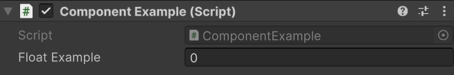

# Components

This document lists all MonoBehaviour components in the package.

## Ask From Stroke

Handles image recognition requests from strokes and manages sticky note feedback.

| Property | Description |
|----------|-------------|
| **Mx Ink Handler** | *No description provided* |
| **Text Offset** | *No description provided* |
| **Mr Image Viewer Manager** | *No description provided* |
| **Vr Camera Capture Texture** | *No description provided* |
| **OverlayVR Camera** | *No description provided* |
| **Default Delay** | *No description provided* |
| **Prompt Capture Delay** | *No description provided* |
| **Result Note Color** | *No description provided* |
| **Processing Note Color** | *No description provided* |
| **Processing Text Color** | *No description provided* |
| **Result Text Color** | *No description provided* |
| **Save Debug Images** | *No description provided* |
| **Speech Recognizer** | *No description provided* |

## Audio Recorder

Non-blocking audio recorder optimized for Quest/Android. Uses a continuous microphone recording with ring buffer for smooth operation.

| Property | Description |
|----------|-------------|
| **Ring Buffer Seconds** | *No description provided* |
| **Sample Rate** | *No description provided* |
| **Auto Play Recording** | *No description provided* |
| **Auto Play Delay** | *No description provided* |

## ChatGPT Request

Handles API requests to ChatGPT service with image input.

| Property | Description |
|----------|-------------|
| **Api Key** | *No description provided* |
| **Model** | *No description provided* |
| **Api Url** | *No description provided* |

## Component Example

This is a component example, inheriting from MonoBehaviour. Make sure to delete this file when using the package template.

| Property | Description |
|----------|-------------|
| **Float Example** | This is a public property example, with a private backing field that is serialized. |

## Device Handler

Handles stylus device connections and manages stylus handedness

## Dynamic End Cap Controller

Controls LineRenderer cap vertices based on point count and segment length. Hides caps when only two points remain and their distance is below a threshold. Otherwise, restores the original cap setting.

## Gesture Debugger

Debug display for hand gesture data

| Property | Description |
|----------|-------------|
| **Left Hand Debug Text** | *No description provided* |
| **Right Hand Debug Text** | *No description provided* |
| **Show Debug Vectors** | *No description provided* |
| **Show Finger Extensions** | *No description provided* |
| **Show Gesture Analysis** | *No description provided* |

## Gesture Detector

Enum defining hand bone indices

| Property | Description |
|----------|-------------|
| **Left Hand Skeleton** | *No description provided* |
| **Right Hand Skeleton** | *No description provided* |
| **Reference Camera** | *No description provided* |
| **Thumb Max Open Angle** | *No description provided* |
| **Thumb Max Open Angle** | *No description provided* |
| **Thumb Max Open Angle** | *No description provided* |
| **Detect Palm Orientation** | *No description provided* |
| **Orientation Threshold** | *No description provided* |

## Line Drawing

Component for creating line drawings

## MR Image Viewer Manager

Manages image composition for mixed reality applications. Combines WebCam and VR camera textures for visual processing.

## Passthrough Camera Permissions

PLEASE NOTE: Unity doesn't support requesting multiple permissions at the same time with `Permission.RequestUserPermissions` on Android. This component is a sample and shouldn't be used simultaneously with other scripts that manage Android permissions.

| Property | Description |
|----------|-------------|
| **S_asked Once** | *No description provided* |

## Web Cam Texture Manager

*No summary provided*

| Property | Description |
|----------|-------------|
| **Has Permission** | *No description provided* |
| **Has Permission** | *No description provided* |

## Smart Widget Factory

Factory for creating smart widgets based on recognized text

## Speech Recognizer

Coordinates audio recording and speech recognition. Acts as a high-level controller for the speech recognition pipeline.

| Property | Description |
|----------|-------------|
| **Audio Recorder** | *No description provided* |
| **Whisper Request** | *No description provided* |
| **Auto Transcribe After Recording** | *No description provided* |

## Sticky Note

Represents a sticky note in the scene

## Sticky Note Collector

Manages sticky note collection, following and display in gallery mode.

| Property | Description |
|----------|-------------|
| **Stylus Transform** | *No description provided* |
| **Stylus Handler** | *No description provided* |
| **Long Press Time** | *No description provided* |
| **Collect Radius** | *No description provided* |
| **Follow Speed** | *No description provided* |
| **Follow Distance** | *No description provided* |
| **Note Spacing** | *No description provided* |
| **Rotation Speed** | *No description provided* |
| **Release Distance** | *No description provided* |
| **Max Row Width** | *No description provided* |
| **Note Padding** | *No description provided* |
| **Row Vertical Padding** | *No description provided* |
| **Transition Duration** | *No description provided* |
| **Note Delay** | *No description provided* |
| **Transition Curve** | *No description provided* |
| **Wall Detection Distance** | *No description provided* |
| **Wall Layer Mask** | *No description provided* |
| **Ignore Layer Mask** | *No description provided* |
| **Attach To Walls Enabled** | *No description provided* |
| **Wall Attachment Offset** | *No description provided* |

## Sticky Note Manager

Manages sticky note creation and operations.

## Stroke Manager

Manages strokes.

## Stroke Texture Projector

*No summary provided*

| Property | Description |
|----------|-------------|
| **Proximity Threshold** | *No description provided* |
| **Max Strokes To Consider** | *No description provided* |
| **Texture Resolution** | *No description provided* |
| **Padding Percent** | *No description provided* |
| **Pen Thickness** | *No description provided* |
| **Save Debug Images** | *No description provided* |
| **Vr Camera Capture Texture** | *No description provided* |

## Stylus Cursor

Stylus surface interaction and cursor feedback.

| Property | Description |
|----------|-------------|
| **Cursor Prefab** | *No description provided* |
| **Pressure Scale Multiplier** | *No description provided* |
| **Height Offset** | *No description provided* |
| **Base Color** | *No description provided* |
| **Pressure Color** | *No description provided* |
| **Renderer Path** | *No description provided* |
| **Interactable Tag** | *No description provided* |
| **Max Interaction Distance** | *No description provided* |
| **Pressure Threshold** | *No description provided* |
| **Stylus Handler** | *No description provided* |
| **Show Debug Ray** | *No description provided* |
| **Ray Hit Color** | *No description provided* |
| **Ray Miss Color** | *No description provided* |

## Stylus Marking Menu

Stylus marking menu for front button.

| Property | Description |
|----------|-------------|
| **Stylus Handler** | *No description provided* |
| **Menu Spawn Point** | *No description provided* |
| **Menu Distance** | *No description provided* |
| **Long Press Threshold** | *No description provided* |
| **Ray Interactor** | *No description provided* |
| **Scene Menu** | *No description provided* |
| **Animate Menu Appearance** | *No description provided* |
| **Appear Animation Duration** | *No description provided* |
| **Button Hover Scale** | *No description provided* |
| **Hover Scale Transition Duration** | *No description provided* |

## Todo Item

Single todo item.

| Property | Description |
|----------|-------------|
| **Item Text** | *No description provided* |
| **Completion Toggle** | *No description provided* |

## Unity Main Thread Dispatcher

Dispatch calls from background threads to Unity's main thread. Required for making Unity API calls from Tasks or threads.

## VR Camera Capture Texture

Captures camera frames from VR camera.

## Wall Data Collector

Collects and visualizes wall data.

## Wall Normal Visualizer

Collects and visualizes wall data.

## Whisper Request

Handles communication with Whisper API for speech recognition. Converts AudioClip to WAV format and processes API responses.

| Property | Description |
|----------|-------------|
| **Api Url** | *No description provided* |
| **Language** | *No description provided* |
| **Beam Size** | *No description provided* |
| **Vad Filter** | *No description provided* |
| **Word Timestamps** | *No description provided* |

_This file is automatically generated. Do not edit manually._