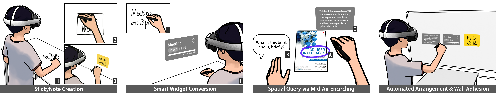

# Inkfinity: Augmenting Handwriting with Contextual Awareness in AR

Inkfinity is an AR interaction paradigm that uses a 6DoF stylus and LLMs to bridge physical handwriting with intelligent digital workflows. It allows users to transform handwritten notes on any physical surface into interactive AR elements and perform on-demand contextual queries of real-world objects.

## Teaser



**Core Interaction Workflows in Inkfinity.**

- **Panel 1 (Left) - StickyNote Creation:**
  (1) User writes on a physical surface.
  (2) Encircling the handwriting defines a selection.
  (3) The selection transforms into a 3D AR sticky note.
- **Panel 2 (Center Left) - Smart Widget Conversion:**
  (I) A handwritten note (e.g., "Meeting at 3pm") is
  (II) automatically converted by a VLLM into an interactive AR smart widget (e.g., a Reminder).
- **Panel 3 (Center Right) - Spatial Query:**
  (A) User encircles a real-world object (e.g., a book cover) in their passthrough view.
  (B) The user then provides a query (e.g., via voice prompt).
  (C) VLLM-generated contextual information is displayed as an AR overlay.
- **Panel 4 (Right) - Automated Arrangement & Wall Adhesion:**
  Collected AR notes and widgets are adhered to a recognized physical surface (e.g., a wall) and automatically arrange themselves for optimal viewing.

---

## Requirements

- Unity 6000.0.39f1
- Logitech MX Ink stylus
- Meta Quest 3 (or Meta Quest 3S)

---

## Project Information

This project was developed as an Independent Study at the XR Collaboratory (XRC), Cornell Tech.

- **Project Documentation:** [https://xrc-students.github.io/xrc-students-sp2025-p36-yan/](https://xrc-students.github.io/xrc-students-sp2025-p36-yan/)
- **XR Collaboratory:** [https://xrcollaboratory.tech.cornell.edu/](https://xrcollaboratory.tech.cornell.edu/)

---

## Getting Started

1.  **Clone the Repository:**
    ```bash
    git clone https://github.com/crazycatseven/Inkfinity.git
    ```
2.  **Open in Unity & Switch Platform:** Open the project in Unity Hub with the specified Unity version. In `File > Build Settings`, switch the platform to `Android`.
3.  **ChatGPT API Key:**
    - Obtain your own API key from [OpenAI](https://platform.openai.com/api-keys).
    - In the Unity Editor, navigate to the `Main Scene`. Select the `ChatGPT Request` GameObject in the Hierarchy.
    - In the Inspector panel, find the `Api Key` field and paste your key.
4.  **(Optional) Faster Whisper for Voice Input:**
    - For voice input functionality, you need to deploy [Faster Whisper](https://github.com/crazycatseven/Faster_whisper) locally.
    - Once deployed, note the API server address (e.g., `http://192.168.50.89:8080/transcribe`).
    - In the Unity Editor, navigate to the `Main Scene`. Select the `Whisper Request` GameObject in the Hierarchy.
    - In the Inspector panel, find the `Api Url` field and paste your Faster Whisper server URL.
5.  **Build and Deploy to Meta Quest 3/3S:**
    - In `File > Build Settings`, ensure your Meta Quest device is connected and selected.
    - Click `Build And Run`.
    - **Note:** The spatial query feature (encircling real-world objects) relies on passthrough camera access and **must be tested on a built application** running on the Quest device. The sticky note creation and manipulation features may partially work in the Unity Editor for quick testing.

---

## How to Use Inkfinity

Please refer to our paper for detailed interaction designs. Key interactions include:

- **Writing & Sticky Note Creation:** Write on any physical surface with the MX Ink stylus. Draw a single-stroke, well-defined rectangular bounding box around your handwriting to transform it into a 3D AR sticky note.
- **Smart Widget Conversion:** Handwritten notes with recognizable patterns (e.g., "Meeting at 3pm," to-do lists, timers) will be automatically converted into interactive AR smart widgets by VLLMs.
- **Spatial Query:** Encircle a real-world object in your passthrough view. Then, use voice input or mid-air handwriting with the stylus to provide a query or keywords. Contextual information will appear as an AR overlay.
- **Stylus Controls (MX Ink):**
  - **Front Button (Primary):** Click and drag to move sticky notes.
  - **Front Button (Long Press):** Press and hold to open the marking menu. Keep holding while moving the stylus to highlight an option, then release to select.
  - **Middle Button (Secondary/Air Canvas):** Press to draw in mid-air (for query keywords or general drawing).
  - **Rear Button (Tertiary/Eraser):**
    - **Single Click:** Undo the last stroke or action.
    - **Long Press:** Activate batch selection to collect multiple nearby sticky notes. Release to adhere the collected notes to a recognized physical surface.

---

## Troubleshooting & Known Issues

### Android Manifest Configuration for Unity 6

**This project has been pre-configured with the necessary Android Manifest changes for Unity 6.** However, if you make other modifications to your project settings, particularly those affecting Android build configurations, or if you regenerate the manifest, you may need to ensure the following:

If you are using **Unity 6**, the Android Manifest requires specific configuration for this project to run correctly on Android. The Unity Player Activity needs to be changed from `UnityPlayerActivity` to `UnityPlayerGameActivity`.

You can update the Android Manifest using one of these methods:

1.  **Use Meta XR SDK Tools (Recommended):**
    - In the Unity Editor, navigate to `Meta > Tools > Update AndroidManifest.xml` or
    - Navigate to `Meta > Tools > Create store-compatible AndroidManifest.xml`.
2.  **Manual Update:**
    - Open your project's `AndroidManifest.xml` file (usually located at `Assets/Plugins/Android/AndroidManifest.xml` after the Meta tools generate it, or you might need to create/find it).
    - Change the line:
      `android:name="com.unity3d.player.UnityPlayerActivity"`
      to:
      `android:name="com.unity3d.player.UnityPlayerGameActivity"`

---
